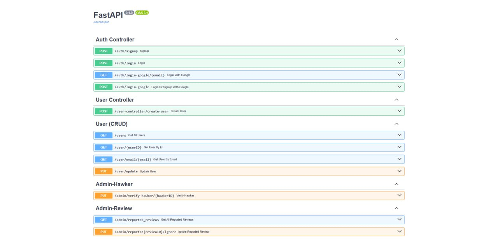
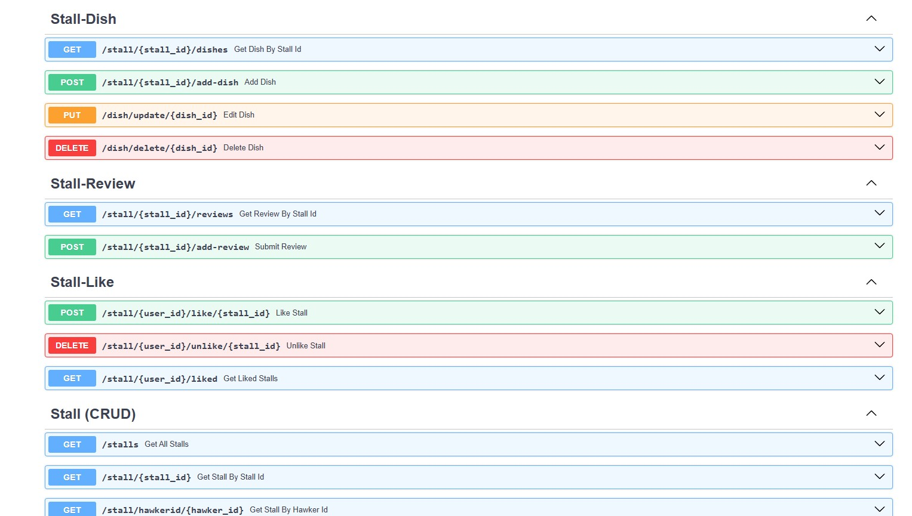
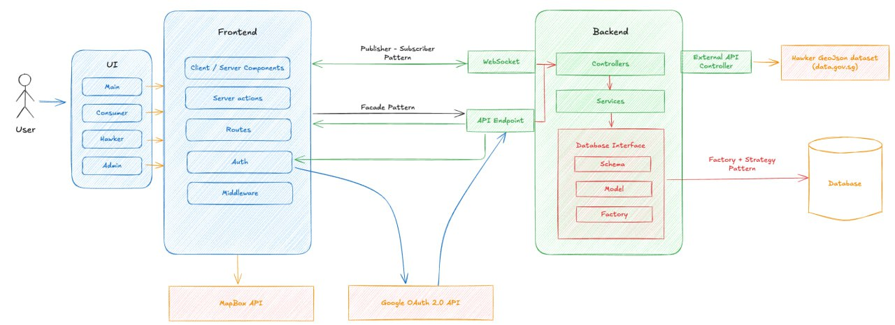

# Hawkar 🍲
Welcome to the official repository for our NTU SC2006 Software Engineering group project Hawkar.

<p align='center'>
  
</p>

<p align="center">
  <a href="https://youtu.be/u0UK_BccOSU">Demo Video</a>
</p>

Hawkar is a smart web application that helps users easily discover and navigate hawker centres across Singapore. Whether you're craving local favourites or exploring new food spots, Hawkar provides a seamless experience with real-time information, interactive maps, and geolocation support. Designed to celebrate and support the vibrant hawker culture, it allows users to explore nearby stalls, check amenities, and stay connected to the heart of Singapore’s food heritage.

---
# Table of Contents📚
- [Setup Instructions](#setup-instructions)
  - [Frontend](#frontend)
  - [Backend](#backend)
    - [Database Seeding](#database-seeding)
- [Pre-configured Users](#pre-configured-users)
- [Documentation](#documentation)
    - [API Docs](#api-docs)
        - [API Endpoints](#api-endpoints)
- [App Design](#app-design)
  - [Overview](#overview)
  - [Frontend](#frontend-structure)
  - [Backend](#backend-structure)
  - [Design Patterns](#design-patterns)
- [Credits](#tech-stack)
  - [Tech Stack](#tech-stack)
  - [External APIs](#external-apis)
  - [Contributors](#contributors)
---

# Setup Instructions

**Note** that the backend has to be up and running first **before** the frontend.

## Frontend

1. In the `/frontend` directory, install the required node modules.

```bash
npm install
```

2. Start the application.

```bash
npm run dev
```

And you are ready to start using the Hawkar Frontend! The frontend application is running on http://localhost:3000/


## Backend

Once Docker has been installed, run the backend as follows:
1. Run Docker desktop and ensure that the Docker Engine is up and running.
2. In the directory, start the application
   ```bash
   cd ...\...\SC2006-Hawkar
   ```
3. Build all of the requiremnt services via docker compose:
   ```bash
   docker compose up -d --build
   ```

### Database seeding

Note to delete any ```.db``` files in the app project folder before proceeding with data seeding to avoid errors.

#### Seeding

The backend, upon execution, should automatically seed the backend database with a set of developer-predetermined data. Should you want to prevent this from happening, simply make comment line 20 in the ```.\backend\app\main.py```

```python
# Seed database
# Uncomment the line below if you want to seed the database
add_event_listener_to_seed_database()   # <--make comment this line here

```

The database seeded by the seeding process, aside from a full list of all the hawker centres in Singapore, will include the following (note that these tables are abridged):

---

# Pre-configured Users

#### Users seeded

| Name          | Email Address              | Role      |
|---------------|-----------------------------|-----------|
| Admin Jane    | admin1@gmail.com            | ADMIN     |
| Doggo         | admin2@gmail.com            | ADMIN     |
| John Consumer | john.consumer@example.com   | CONSUMER  |
| Alice Hawker  | alice.hawker@example.com    | HAWKER    |
| Bob Hawker    | bob.hawker@example.com      | HAWKER    |

#### Stalls seeded

| Stall ID | Stall Name       |
|----------|------------------|
| 7        | Alice's Delights |
| 8        | Bob's Gourmet    |

#### Dishes seeded

| Dish Name        | Stall Name       | Price |
|------------------|------------------|-------|
| Signature Special| Alice's Delights | 8.5   |
| Gourmet Burger   | Bob's Gourmet    | 12.9  |
| Premium Pasta    | Bob's Gourmet    | 14.9  |

---

# Documentation 

## API Docs

Our web application utilizes FastAPI, which has an in-built documentation function for the created routes, attached below is a screenshot of the documentation, which can be found at https://sc2006-hawkar.onrender.com/docs, 

Note: The screenshots displays only some of the routes, for the full picture, please visit the website after the [backend](#running-the-backend-logo) is up and running to look at all the API routes




### API Endpoints

Displayed in the FastAPI documentation, there are of 3 main categories: **Controllers**, **CRUD** and **Misc**:

1. **Controllers** - Handles the vast majority of the business logic relating to sign-ups, login, edits, adding reviews, searching, etc. It is also resposible for converting the .json requests from the front end to pydantic schemas to be sent to the CRUD services for transfer into the database
2. **CRUD** - Whilst displayed in the FastAPI documentation, it, given how it works in the code and also the application design diagram, are not endpoint APIs, what they do is convert the pydantic model inputs from the controllers and convert them to an SQL model to be stored in the SQL database.
3. **Misc** - Other important functions that are outside the scope of the controller class, namely to handle admin reviews and approvals.
   
---

# App Design

## Overview

Below will be the application design diagram, meant as a general overview of how our web application works:



*Credits to Thant Htoo Aung*

---
### Frontend Structure
**`📂 app`**
- User Interface and its subfolders all contain the User Interface and basic display and redirect logic for the functions available to the 3 roles of Consumer, Hawker and Admin.
  
**`📂 components`**
- Contains both some UI design logic and all of the all important helper functions that sends requests to the backend and handles responses from the backend.
  
**`📂 middleware.ts`**
- Designed to protect that use case routes and to prevent Users with a different role from accessing the pages and functions meant for another or a user whose login instance cannot be verified.

**📂`nextconfig.ts`** 
- Handles the business logic of uploading and retrieving photos from the **Minio** client.

---

### Backend structure 
**`📂 Assets`**
- Contains the seeding data and ```helper.py``` that seeds the data after starting up the backend. Including Geojson data and related image data.
  
**`📂 Controllers`**
- Contains the various services classes that handles the vast majority of the backend business logic and serve as the vital endpoint APIs that both sends out responses to the user and handles requests by the user to the backend.<br/>
  
**`📂 Factory`**
- Contains the classes responsible for the creation, initiation and definitions relating to the SQL database, SQL sessions and response models that the web application relies on to store data.
  
**`📂 minio`**
- Holds the default images that will be featured on the website upon start up, for these images will be first stored in the image hosting client **minio** for use by the website. Minio is also used to store user-uploaded images.
  
**`📂 Models folder`**
- Contains the SQL models and SQL table maps that is will be used to store data in the SQL database.
  
**`📂 Routers`**
- Contains the classes that calls in the controller classes in real time as the frontend sends requests to the backend. They are the ones instantiated and run in the main application file.
  
**`📂 Schemas`**
- Defines all the request and response fields.
  
**`📂 Services`**
- Contains methods to create, read, update and delete business objects.
  
**`📂 Websocket`**
- Contains the handler function for the **websocket server** to serve as the information highway for the subscription and notifications system.

**`📂 database.py`**
- Fetches the SQL sessions that is used by almost every class in the backend.

---

# Design Principles 

#### The SOLID Principles

**Single Responsibility Principle** - Every class has a very specific set of functions dedicated solely to that particular aspect of the backend infrastructure, the controller classes do not deal with CRUD, the CRUD classes do not take in requests from the frontend and each control class is focussed on one specific role, the ```review.py``` classes do not for instance deal with searching, that is handled with the ```search.py```, simimlarly, the User control classes do not deal with functions specific to eac role

**Open-Closed Principle** - The Factory-Strategy and facade patterns enables the application to be open to extensions and upscaling, no modifications to the base is needed when new features are added.

**Liskov Substitution Principle** - The superclass **User** contains all of the common attributes found in its subclasses in the roles.

**Interface Segregation Principle** - Each class will only contain the functions that it absolutely needs and each function uses its own model for as much as possible, User Create and User Update for instance use different schematic models that do not include attributes that those respective functions do not needs.

**Dependency Inversion Principle** - Clealrly indicated in the ```database.py``` files in the ```.\backend\app\factory``` folder, instead of relying on one specific SQL database service, it is instead configured to use a SQL interface in general to allow for various SQL classes to be used, allowing for greater versatility.

---

# Credits

### Tech Stack

External services and base software used in the application:

**Frontend**

1. TypeScript
2. Next.js
3. TailwindCSS

**Backend**

1. Minio 
2. Docker
3. Websocket
4. FastAPI

---

# External APIs

1. [Google OAuth 2.0](https://developers.google.com/identity/protocols/oauth2)
2. [Government Hawker Geojson Datasheet](https://data.gov.sg/datasets/d_4a086da0a5553be1d89383cd90d07ecd/view)

---

# Contributors

Credits to all the members of SC2006 ACDA2.

| Name     | Github   | Role     |
|----------|----------|----------|
|   Thant Htoo Aung |    [jack-thant](https://github.com/jack-thant)|     Team Leader and main developer for the frontend   |
|   Natthakan Saeng-Nil  |   [Tanknam](https://github.com/Tanknam)       |   Main developer for Backend       |
|    Cao Junming   |    [newguyplaying](https://github.com/newguyplaying)      |   Backend and documentation      |
|  Muhammad Aliff Amirul Bin Mohammed Ariff |  [showtimezxc](https://github.com/showtimezxc)  |  Frontend and documentation   |
|    Kow Zi Ting      |     [HighlandK](https://github.com/HighlandK)     |     Frontend and documentation     |
